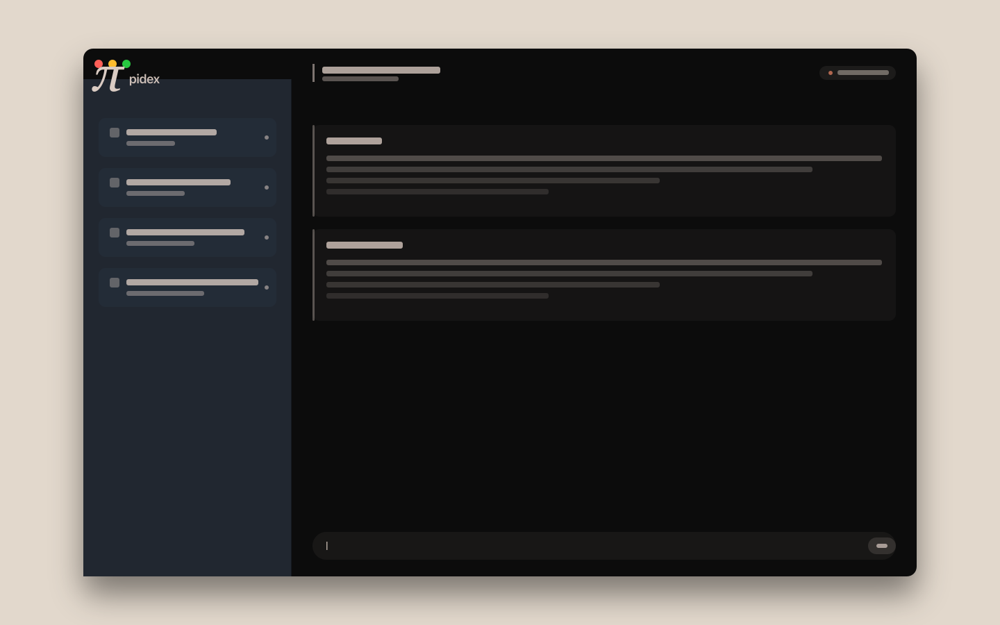

<div align="center">


**A desktop workbench for the Pi coding agent.**
**Workspace-first, not chat-first.**

[Quick Start](#quick-start) · [Architecture](docs/openpi-architecture.md) · [Project Brief](docs/openpi-project-brief.md) · [Pretext Deep-Dive](docs/openpi-pretext-deep-dive.md)

[](https://github.com/echohello-dev/pidex/actions/workflows/ci.yml)
[](https://www.electronjs.org/)
[](https://react.dev/)
[](https://www.typescriptlang.org/)

</div>

## Why this exists

Daily coding-agent work means juggling repos, branches, and sessions, and the current tools are chat-first: the primary screen is a conversation, not your work. pidex flips that. It is a kitchen bench where every active repo, its branch, its sessions, and what has gone stale are visible at a glance.

| The pain, observed daily | pidex's answer |
|---|---|
| Workspace switching takes too many clicks | One dashboard of every repo with Pi sessions, sorted by last activity |
| Losing the thread when resuming | Repo, branch, and session state as first-class UI, not buried chat history |
| Long sessions get sluggish | [Pretext](https://github.com/chenglou/pretext) measures multiline text off the DOM hot path, ~600x faster than browser measurement |
| Worktrees feel unreliable | Git and worktree state surfaced directly, no chatting with the agent to switch branches |

pidex is a personal project: learn by building, sharpen day-to-day DX, and share a cleaner local-first harness pattern for coding agents. Not a commercial product, not an OpenCode clone. Install, BYOK, and provider wiring belong to its sibling, Weldable; pidex focuses entirely on the daily coding workflow.

> A developer's kitchen bench, not a chat pane.

<div align="center">



</div>

## Quick Start

You need [mise](https://mise.jdx.dev/) and the [Pi CLI](https://pi.dev/). The dashboard reads existing sessions from `~/.pi/agent/sessions`, so run `pi` in a repo or two first if you want it to light up.

```bash
$ git clone git@github.com:echohello-dev/pidex.git && cd pidex
$ mise install
$ bun install
154 packages installed [2.61s]

$ mise run dev
```

That starts Vite on :5173 and launches Electron against it. For a production build:

```bash
$ mise run build
[build] $ bunx tsc -p tsconfig.main.json
[build] $ bunx tsc -p tsconfig.preload.json
[build] $ bunx vite build
vite v8.0.11 building client environment for production...
✓ 29 modules transformed.
✓ built in 760ms

$ mise run start
```

## Features

### Shipped today

| Feature | What you get |
|---|---|
| Workspace dashboard | Every repo with Pi sessions: branch, session count, last activity |
| Session resume | Reopen any past session from its `.jsonl` transcript |
| Streaming transcript | Token-by-token text with tool-call cards, one tab per session |
| Pi over RPC | Each session is a supervised `pi --mode rpc` subprocess |
| Pretext measurement | Row heights and line counts computed without touching the DOM |

### Built on

| Layer | Choice | Why |
|---|---|---|
| Shell | Electron 41 | Native window, context-isolated, typed `window.openpi` preload bridge |
| UI | React 19.2 + Vite 8 | HMR in dev, fast renderer bundles |
| Text measurement | `@chenglou/pretext` | ~15KB, DOM-free, built for virtualised text-heavy lists |
| Language | TypeScript 6 | Strict types across main, preload, and renderer |
| Package manager | Bun | Fast installs, frozen lockfile in CI |
| Toolchain | mise | Node and Bun versions pinned, every command via `mise run` |

## Architecture

```
┌────────────────────────────────────────┐
│  Renderer (React 19 + Pretext)         │   ← dashboard, session tabs, timeline
└───────────────────┬────────────────────┘
                    │  typed IPC (window.openpi)
┌───────────────────▼────────────────────┐
│  Main process (Electron)               │   ← workspace registry, event normalization
└───────────────────┬────────────────────┘
                    │  NDJSON over stdio
┌───────────────────▼────────────────────┐
│  Pi runtime (`pi --mode rpc`)          │   ← one supervised subprocess per session
└────────────────────────────────────────┘
```

The renderer draws. The main process owns the workspace registry and every Pi subprocess, and normalizes agent events before they cross the bridge. Preload exposes a narrow typed API, so renderer code never touches Node.

Pi runs out-of-process over RPC instead of being embedded via SDK. That keeps the UI alive when a session crashes, makes restart supervision simple, and leaves the door open to non-Node clients later. The full decision matrix is in [docs/openpi-architecture.md](docs/openpi-architecture.md).

## Philosophy

1. **Workspace-first, not chat-first.** The primary screen is work state, not the latest conversation thread.
2. **Fast by default.** Compounded multi-second delays are real cognitive drag.
3. **Repo-aware.** Branch, dirty state, last commit, and worktree are first-class concepts.
4. **Work-aware.** Task context belongs next to the session, not in another app.
5. **Local and extensible.** Pi's minimal runtime stays intact; the richness lives in the UI layer.

## Roadmap

Shipped:

- [x] Workspace dashboard over `~/.pi/agent/sessions`
- [x] Session resume and streaming transcript with tool cards
- [x] RPC session supervision
- [x] Pretext-backed text measurement

Next up:

- [ ] **Diff viewer**, virtualised summaries with file-level change previews
- [ ] **Session fork**, branch sessions visually
- [ ] **Worktree switching** from the UI

Long term:

- [ ] Richer git and PR context in the dashboard
- [ ] Task tracker awareness alongside sessions
- [ ] Optional adapters for other agent runtimes

## Design tokens

The workbench inherits its palette from the [Pi coding agent](https://pi.dev) so the desktop harness feels like part of the same family as the runtime it drives. Source of truth: [`scripts/_design.py`](scripts/_design.py), hexes pulled from `pi.dev/style.css`.

| Token | Hex | Role |
|---|---|---|
| warm-black | `#13110f` | Primary window background |
| bg-deep | `#0d1116` | Deepest surface |
| bg-canvas | `#161d27` | Canvas surface |
| panel | `#212730` | Sidebar / panel surface |
| panel-soft | `#252f3d` | Card surface |
| parchment | `#dacbc2` | Named cream, primary mark and text |
| moonstone | `#ebe7e4` | Lighter cream, lit facet |
| driftwood | `#5c5752` | Warm mid-gray, shadow facet |
| terracotta | `#844f3b` | Warm bronze accent |
| terracotta-light | `#b86b52` | Accent highlight, status dots |
| sunkissed | `#e1b06e` | Warm gold accent |
| sage | `#a3a473` | Sage accent |
| accent-blue | `#6a9fcc` | Links, focus rings |

Regenerate assets after a token edit:

```bash
uv run --with fonttools python scripts/build-icon.py        # assets/icon, mark
uv run --with fonttools python scripts/build-screenshot.py   # docs/assets/screenshot
```

## Documentation

| Doc | What it covers |
|---|---|
| [docs/openpi-project-brief.md](docs/openpi-project-brief.md) | The thesis, pain points, positioning, MVP slice |
| [docs/openpi-architecture.md](docs/openpi-architecture.md) | Process boundaries, IPC schema, SDK vs RPC matrix |
| [docs/openpi-pretext-deep-dive.md](docs/openpi-pretext-deep-dive.md) | Why DOM-free text measurement, and where it applies |

## Project Status

Alpha. A personal workbench, not a product that ships. Expect sharp edges and breaking changes. Pushes to `main` tag calendar-versioned releases (`YYYY.MM.DD`) with notes generated from merged PRs.

## License

No license chosen yet. Personal project, shared in the open.

---

<div align="center">

Made with Electron, Pi, and an unreasonable attachment to fast text layout.

</div>
