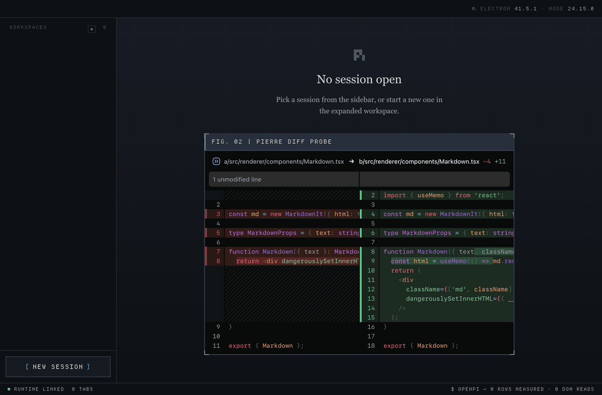
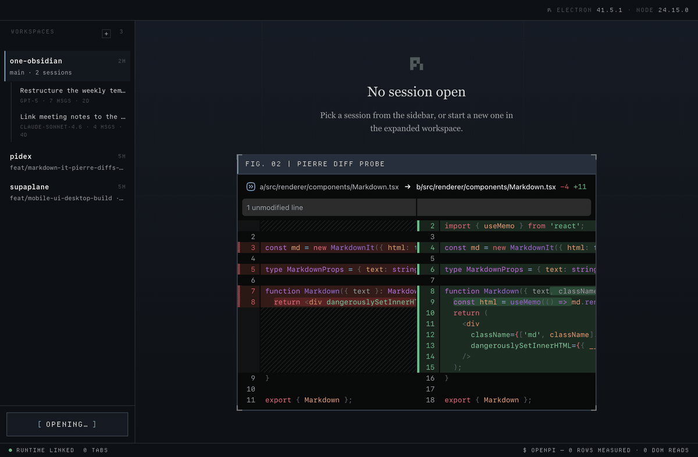

<div align="center">


**A desktop workbench for the Pi coding agent.**
**Workspace-first, not chat-first.**

[Install](#install) · [Quick Start](#quick-start) · [Architecture](docs/pidex-architecture.md) · [Distribution](docs/distribution.md)

[](https://github.com/echohello-dev/pidex/actions/workflows/ci.yml)
[](https://github.com/echohello-dev/pidex/releases/latest)
[](LICENSE)
[](https://www.electronjs.org/)
[](https://react.dev/)
[](https://www.typescriptlang.org/)

</div>

## Why this exists

Daily coding-agent work means juggling repos, branches, and sessions, and the current tools are chat-first. pidex is the kitchen bench: every active repo, its branch, its sessions, and what's stale, visible in one glance.

## In action

| | |
|---|---|
|  |  |
| App booting, workspaces populate | The workbench, fully loaded |

## Install

You need the [Pi CLI](https://pi.dev/). The dashboard reads existing sessions from `~/.pi/agent/sessions`.

### macOS

```bash
$ brew tap echohello-dev/tap
$ brew install --cask pidex
```

Or download `pidex-mac-arm64.dmg` (Apple silicon) or `pidex-mac-x64.dmg` (Intel) from [Releases](https://github.com/echohello-dev/pidex/releases/latest). First launch is right-click → Open; the DMG is unsigned until we add a Developer ID.

### Windows

The [echohello-dev tap](https://github.com/echohello-dev/homebrew-tap) is the Winget source until `echoHello.Pidex` is in the community repo. WinGet cannot add a GitHub repo directly, so the tap ships a one-liner that installs the latest manifest:

```powershell
> irm https://raw.githubusercontent.com/echohello-dev/homebrew-tap/main/winget/install-pidex.ps1 | iex
```

Scoop from the same tap:

```powershell
> scoop bucket add echohello https://github.com/echohello-dev/homebrew-tap
> scoop install pidex
```

Or download `pidex-win-x64.exe` from [Releases](https://github.com/echohello-dev/pidex/releases/latest).

### Linux

```bash
$ curl -sL -o pidex.AppImage \
    https://github.com/echohello-dev/pidex/releases/latest/download/pidex-linux-x64.AppImage
$ chmod +x pidex.AppImage && ./pidex.AppImage
```

A `.deb` and a GHCR image (`ghcr.io/echohello-dev/pidex`) ship alongside. Docker needs an X11 socket; prefer the AppImage on a real desktop. Full matrix in [docs/distribution.md](docs/distribution.md).

## Quick Start

From source you need [mise](https://mise.jdx.dev/) as well.

```bash
$ git clone git@github.com:echohello-dev/pidex.git && cd pidex
$ mise install
$ bun install
$ mise run dev          # starts Vite + Electron
```

For a production build: `mise run build` then `mise run start`. Native installers: `mise run package`.

## Architecture

```
┌────────────────────────────────────────┐
│  Renderer (React 19)                   │   ← dashboard, session tabs, timeline
└───────────────────┬────────────────────┘
                    │  typed IPC (window.pidex)
┌───────────────────▼────────────────────┐
│  Main process (Electron)               │   ← workspace registry, event normalization
└───────────────────┬────────────────────┘
                    │  NDJSON over stdio
┌───────────────────▼────────────────────┐
│  Pi runtime (`pi --mode rpc`)          │   ← one supervised subprocess per session
└────────────────────────────────────────┘
```

Pi runs out-of-process over RPC so the UI survives a runtime crash. Pretext handles text measurement so virtualized lists stay smooth in long sessions. Full detail in [docs/pidex-architecture.md](docs/pidex-architecture.md).

## Built on

| Layer | Choice |
|---|---|
| Shell | Electron 41, context-isolated, typed `window.pidex` preload bridge |
| UI | React 19.2, Vite 8 with HMR |
| Text | [`@chenglou/pretext`](https://github.com/chenglou/pretext), DOM-free |
| Language | TypeScript 6 |
| Package manager | Bun |
| Toolchain | mise, all commands via `mise run` |

## License

[Apache-2.0](./LICENSE): see the file for full text. Personal project, shared in the open.

## Star History

<a href="https://star-history.com/#echohello-dev/pidex&Date">
  <picture>
    <source media="(prefers-color-scheme: dark)" srcset="https://api.star-history.com/svg?repos=echohello-dev/pidex&type=Date&theme=dark" />
    <source media="(prefers-color-scheme: light)" srcset="https://api.star-history.com/svg?repos=echohello-dev/pidex&type=Date" />
    
  </picture>
</a>
